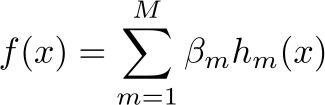
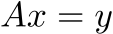
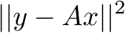

<script type="text/javascript" src="http://cdn.mathjax.org/mathjax/latest/MathJax.js?config=default"></script>

# pynFold - Unfolding with python
[](https://travis-ci.org/vincecr0ft/pynFold)

 

pynFold (pronounced *pen*-fold) is solution of the inverse problem, also known as deconvolution and unfolding. The core functionality is a pythonic implementation of several of the algorithms featured in [RooUnfold](http://hepunx.rl.ac.uk/~adye/software/unfold/RooUnfold.html) ROOT Unfolding Framework aiming to compare unfolding methods with those provided outisde of high energy physics and to increase robustness by eliminating dependencies on the ROOT libraries basing algorithms only on numpy and minimal additional libraries. An extention to the base algorithm featured here is an implementation of the fully basian unfolding method based on work by Clement Helsens, Davide Gerbaudo, and Francesco Rubbo [fbu](https://github.com/gerbaudo/fbu)

## What is Unfolding?

Unfolding relates to the problem of estimating probability distributions in cases where no parametric form is available, and where the data are subject to additional random fluctuations due to limited resolution. The same mathematics can be found under the general heading of inverse problems, and is also called deconvolution or unsmearing. This type of problem is best visualised in the equation form known as the [Fredholm integral](https://en.wikipedia.org/wiki/Fredholm_integral_equation) of the first kind. 


when *g(y)* and *K(y|x)* are known. The Kernel *K*, acts as a smoothing matrix in the forward detector and we can interpret its elements as a matrix of probabilites, strictly positive between 0 and one. Inverting the matrix (if possible) resutls in strictly non-probabilistic terms that instead of smothing add large high frequency components due to arbitrarily small fluctuations. The goal of unfolding is to impose some knowledge about the smoothness of this matrix onto the inversion to suppress such high frequency elements. This process is called regularisation. 

### Discretisation
#### Histograms
The standard representation of the functions *g(y)* and *f(x)* in high energy physics is that of Histograms. In this case the function is evaluated at set points with each of these points being represented as a weight. 

#### B-splines
Another approach see us representing a distribution *x* using a collection of basis functions:



where *h_m* are basis functions which are prespecified the model. Since this model is linear in the new variables standard least squares / MLE methods are possible. B-splines are piecewise polynomials that are joined together to make a single smooth curve. These piecewise *m − 1* degree polynomials are required to be continuous up to the first *m − 2* derivatives

### Regularisation Types
#### Naïeve Solutions
**Inversion** - The Maximum-Likelihood and least squares solutions for inverted kernels are the baseline for most solutions posed here. 

In the histogram representation:


the vector *x* can be found by minimizing the Euclidean 2-norm:



**Corection Factors** - In high energy physics, the kernel is typically obtained from the montecarlo simulation of a *true* distribution and a simulated *measured* response. This method reweights the data by the difference in *true* and *measured distributions*. The uncertainty in this case is taken as the propagated poisson uncertainty of each value.

#### Dimensionality Control
**TSVD** - Perhaps the simplest example of regularisation in this issue is that of the truncated singular value decomposition, **TSVD**. If the Kernel is invertable, an SVD expansion produces a list of coefficients that decay to 0. The speed of this decay can be interpreted as the *smoothness* of the kernel and indeed in the Riemann-Labesgue model most of the high frequency components that cause instabilites in the inversion are produced by the smaller SVD components. TSVD limits the number of components used in the unfolding. Less components typically leads to a smoother distribution however cutting too tightly may lead to Gibbs fluctuations. 

**D'Agostini - Iterative - Bayesian -Richardson-Lucy** - The most common unfolding algorithm used in science. Known as Bayesian unfolding in High Energy Physics (as adopted by d'Agostini) and as Richardson-Lucy in astonomy, variations on this method can also be described as Maximum Likelihood for Poisson distributed data, or expectation-maximation (EM) algorithm incomplete data. A flat distribution is assumed the prior probability and updated given the data. This process is then repeated. If the number of iterations is large then the solution will converge to the Maximum Likelihood estimate (zero bias but large variance). Stopping the number of iterations can limit the contribution of high frequency contributions and minimize the bias-variance trade off. Typically the process in HEP converges after 4 or less iterations. 

**Choice of Discretisation** - Merely representing distributions as Histograms or Splines, introduces a bias in favour of reduced variance. A change of basis might be used to control the bias variance tradeoff in estimators. However, unlike the number of D'Agostini iterations and number of truncated SVD components, this method provides no coherent way to control the regularisation strength.

#### Composite Hypotheses
**Tikonov - Lagrange Multipliers - Ridge Regression** - The most common solution in mathematics and computer science is the application of a lagrange multiplier to control regularisation of a problem. The minimization now becomes


## Usage

The base of any pynfold calculation is defining a fold. 
```
from pynfold import fold
f = fold()
```

The response matrix can either be defined directly as:

```
f.response = [[0.08, 0.02], [0.02, 0.08]]
```
alternatively this can be defined in the *RooUnfold style*
```
f.set_response(n_bins, x_min, x_max)
for i in range(100000):
    xt = np.random.normal(-2.5, 0.2)  # some point drawn from a distribution
    x = some_smearing(xt)
    if x survives_smearing:
        f.fill(x, xt)
    else:
	f.miss(xt)
```
by default the number of 'truth' bins is half the number of measured to avoid underconstrining the problem.

before unfolding we set the `data` distribution that we wish to unfold using this response matrix
```
f.data = [100,150]
```

the unfolding is then performed by running the fold
```
f.run()
```

### different algorithms available
#### Simple matrix inversion
```
f.method = 'invert'
f.run()
hist = f.invert.reco_hist()
```

if the matrix is non-invertable the simple least squares estimate is used.

#### Damped least squares - Tikonov regularisation
```
f.method = 'regularised'
f.tau = 1. # regularisation term
f.run()
hist = f.regularised.reco_hist()
```


#### D'Agostini Iterative (a.k.a - 'Bayesian' unfolding)
```
f.method = 'iterative'
f.iterations = 4  # number of iterations performed
f.run()
hist = f.iterative.reco_hist()
```


### Status
This project is currently under development. If you would like to be involved please contact vincent.croft at cern.ch or contact me on slack. 

this project depends on numpy, scipy and pymc