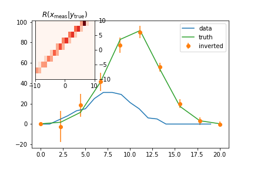

# pynFold - Unfolding with python
[](https://travis-ci.org/vincecr0ft/pynFold)

 

pynFold (pronounced *pen*-fold) is a pythonic implementation of (eventually) many of the [RooUnfold](http://hepunx.rl.ac.uk/~adye/software/unfold/RooUnfold.html) ROOT Unfolding Framework aiming to compare unfolding methods with those provided outisde of high energy physics and to increase robustness by eliminating dependencies on the ROOT libraries basing algorithms only on numpy and minimal additional libraries. 

The base algorithm implemented here is the fully basian unfolding method based on work by Clement Helsens, Davide Gerbaudo, and Francesco Rubbo [fbu](https://github.com/gerbaudo/fbu)

Unfolding relates to the problem of estimating probability distributions in cases where no parametric form is available, and where the data are subject to additional random fluctuations due to limited resolution. The same mathematics can be found under the general heading of inverse problems, and is also called deconvolution or unsmearing.


when *g(t)* and *K(t|s)* are known. This type of equation is also known as the [Fredholm integral](https://en.wikipedia.org/wiki/Fredholm_integral_equation) of the first kind. The Kernel *K*, acts as a smoothing matrix in the forward detector and we can interpret its elements as a matrix of probabilites, strictly positive between 0 and one. Inverting the matrix (if possible) resutls in strictly non-probabilistic terms that instead of smothing add large high frequency components due to arbitrarily small fluctuations. The goal of unfolding is to impose some knowledge about the smoothness of this matrix onto the inversion to suppress such high frequency elements.   

## Usage

The base of any pynfold calculation is defining a fold. 
```
from pynfold import fold
f = fold()
```

The response matrix can either be defined directly as:

```
f.response = [[0.08, 0.02], [0.02, 0.08]]
```
alternatively this can be defined in the *RooUnfold style*
```
f.set_response(n_bins, x_min, x_max)
for i in range(100000):
    xt = np.random.normal(-2.5, 0.2)  # some point drawn from a distribution
    x = some_smearing(xt)
    if x survives_smearing:
        f.fill(x, xt)
    else:
	f.miss(xt)
```
by default the number of 'truth' bins is half the number of measured to avoid underconstrining the problem.

before unfolding we set the `data` distribution that we wish to unfold using this response matrix
```
f.data = [100,150]
```

the unfolding is then performed by running the fold
```
f.run()
```

### different algorithms available
#### Simple matrix inversion
```
f.method = 'invert'
f.run()
hist = f.invert.reco_hist()
```

if the matrix is non-invertable the simple least squares estimate is used.

#### Damped least squares - Tikonov regularisation
```
f.method = 'regularised'
f.tau = 1. # regularisation term
f.run()
hist = f.regularised.reco_hist()
```


#### D'Agostini Iterative (a.k.a - 'Bayesian' unfolding)
```
f.method = 'iterative'
f.iterations = 4  # number of iterations performed
f.run()
hist = f.iterative.reco_hist()
```


### Status
This project is currently under development. If you would like to be involved please contact vincent.croft at cern.ch or contact me on slack. 

this project depends on numpy, scipy and pymc