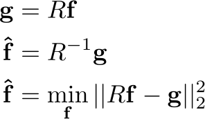

.. image:: https://c1.staticflickr.com/1/588/23404929566_5c9dfed1ef_o.jpg
   :alt: Oh! Crumbs!
   :target: https://github.com/vincecr0ft/pynFold
   :align: center

PynFold - Unfolding With Python
===============================

.. toctree::
   :maxdepth: 2
   :caption: Contents:

.. image:: https://travis-ci.org/vincecr0ft/pynFold.svg?branch=master
   :target: https://travis-ci.org/vincecr0ft/pynFold

The Inverse Problem
-------------------

The process of unfolding is part of a class of problems that arise when our goal is to recover 'interior' or 'hidden' information from the 'outside'. It is used in medical imaging to reconstruct 3D images of the inner workings of body parts through CT scans, and electro-cardiography and similarly in geophysical prospecting and tommography. It is also present in most photo-editing software to 'de-blur' images as in High energy physics where we wish to 'correct' a distribution to account for the limited response of our measurement instruments. All of these problems can be formulated in terms of the Fredholm integral.

 
where *g(y)* and *K(y|x)* are known or are estimated prior to solving the problem in the inverse sense. In the forward case, when *f* and *K* are known we can compute *g* by evaluating the integral.

**Example: Calorimeter response**
Any detection of signals will have some limited resolution on account of the imperfect nature of measurement. In high energy physics a true distribution can be modelled using the technique of Monte Carlo (MC) simulation. This true distribution however will not be measured perfectly by the detector. A typical calorimeter (used to measure a particles energy) will have a response that is *smeared* by a function that has a gaussian distribution and a standard deviation that resembles:

In this way there will be *less* information contained in the measured distribution than originally described since the information has been smeared away. This can be seen visually with a distribution of two gaussians that are smeared to become one. 

Here it is trivial to see that if the only information we know is the response function and the measured distribution the true distribution is subject to certain information that we simply cannot reconstruct. It has been smeared away. 

The true nature of the problem is one step worse. Due to the nature of the Fredholm integral, abritarily small perturbations in the measured distribution *g(y)* can be estimated to have abritrarily large perturbations in the reconstructed/corrected/unfolded distribution. This property of inverse problems is formulated mathematically by the *Riemann-Lebesgue lemma*. The lemma states that the fourier transform of a function with a finite integral (such as in the Fredholm integral) vanishes at infinity. i.e. as the frequency of *f* increases then the amplitude of *g* decreases. In the inverse however, this means that small amplitudes (such as noise) can produce arbitarility large frequency components in the unfolded distribution. In the above example of two peaks being smeared into one, the presence of noise (e.g. too fine a binning in the histogram) in the distribution can produce arbitrary additional peaks in the unfolded response.

**Deconvolution**
A special case for the inverse problem is *deconvolution* this is when the kernel is a function of the difference between *x* and *y*

Unfolding - the case for histograms
-----------------------------------
It is common in high energy physics to represent distributions as histograms as the fininite binning represents the resolution of the detector and the practical discretisation of a continuous distribution as measured by a 'real world' apparatus. This method of approximating $f$ on at selected abscissas for discrete solutions to the fredhom integral is similar to the quadrature method also known as Nyström approximation with some differences in the normalisation. 

This is expressed mathematically as:

where *En* is the quadrature error such that the Fredholm equation becomes:

and the error term is a function of *y* and dependent therefore on any systematics associated with the measurement.

We can apply a similar rationale to the kernel *K* to produce a *Response-Matrix* whose elements are the conditional probability *P(g|f)* for an event that was produced in the 'truth-level' bin *f* to be reconstructed in the reco-level bin *g*.

this now allows us to formulate the problem as a multivariate linear regression. With the truth bins *f* and measured bins *g* related by a matrix of probabilities. The estimators for $f$ can then be obtained through standard least squares minimisation. 

Note that in general the histogram R is invertable if the same binning for true and measured distributions are used since then the matrix is square. This should however be avoided since then the solution is under constrained. The pseudo inverse must be used for non-square matrices and is useful for obtaining the variance of the estimators as:

where *E²* is the underlying error term arrising from the measruement and the noise in the regression.  

Regularisation Methods.
=======================

Naïve
-----
A simple Matrix inversion described above in the default case for estimates.
Of course the response matrix *should* have more measured bins than true and therefore the pseudo-inverse from numpy [#pseudoinverse]_ is used. 

If the response is not full rank it might not be possible to obtain the pseudoinverse like this, in which case an iterative solution for the full least squares solution is provided by the scipy lsqr [#leastsqr]_ function.

.. [#pseudoinverse] numpy.linalg. pinv_

.. [#leastsqr] scipy.sparse.linalg lsqr_

.. _lsqr: https://docs.scipy.org/doc/scipy/reference/generated/scipy.sparse.linalg.lsqr.html#scipy.sparse.linalg.lsqr

.. _pinv: https://docs.scipy.org/doc/numpy/reference/generated/numpy.linalg.pinv.html

Composite
---------
Composite hypotheses act upon the least squares or likelihood based estimation for the unfolded specrum, either by adding a system of lagrange mulipliers to the minimisation function or controling the minimisation process itself.

**damped**

The damped least squares solution is also known as tikonov regularisation or L2 regularisation or ridge regression as found in the `RooUnfold` package as the `TUnfold`.

The form of the minimization now takes the form:

This solution is obtained through the Paige and Saunders algorithm [#leastsqr]_ for spare linear equations and least squares. This algorithm also supports stopping conditions and is suitable for preconditioning of the matrix based on prior estimates which make it suitible for future studies. 

Dimensionality Control
----------------------
In the formulation of the Unfolding problem, it can be seen that the problems arise in the way that non-dominant information is lost or added during the inversion of the kernel function. This can be solved via controling the dimensionality of the kernel itself to remove these problematic small amplitute components. 

**TSVD**

Truncated Singular Value Decomposition is one of the most intuative regularisation methods. In the Singular Value Expansion (SVE) of dummy kernels it can be seen that the smaller coefficient of the contributions to the response function the more likely it is to produce some high frequency fluctuation to the reconstructed distribution. By truncating these values we are imposing a smoothness constraint on the inverted response. 

The Singular Value Decomposition of a matrix can be understood as the axes of the least squares fitted elipse, together with it's orientation and a projection onto these axes. The square sum of these values should contain the entire valriance of the matrix. By truncating these singular values we can produce a series of estimators that contain some fraction of the variance and therefore assert some degree of smoothness on the system. 

Control over the degree of regularisation in this case is obtained by selecting the number of values to truncate. It stands to reason that if the distribution does not contain very many singular values truncating too many will result in a loss of information. 

**Richardson-Lucy**

The Richardson-Lucy algorithm, also known at iterative unfolding or Bayesian unfolding in high energy physics [#bayesian]_ this method is commonly used in photo-editing/restoration and in Astronomy [#astro]_. The Point Spread Function (PSF) mentioned in some literature with respect to the Richardson-Lucy algorithm is equivalent to the Response Matrix described previously. 

The R-L algorithm iteratively updates a series of estimates for the unfolded distribution with the estimate provided by the . If the number of iterations is infinite then the Maximum Likelihood solution is obtained. The initial guess for tlshe unfolded distribution is given by a flat distribution normalised to the number of events. 

.. [#bayesian] Originally derived using Bayesian arguments the R-L algorithm was introduced to High Energy Particle physics by D'Agostini with the label 'Bayesian Unfolding' and is implemented in RooUnfold as such. However the algorithm has since been interpreted in a purely mathematical way. Though Bayes theorem is used to write the conditional probability of events the estimators obtained at the end of each iteration are not a sumary of the posterior probability density function for the distribution. Since the estimators are not based on the prior probability of the estimators the method is not strictly a bayesian method.

.. [#astro] though the R-L algorithm is very common in some fields such as astronomy, responses to the algorithms performance can vary hugely. In high energy phyiscs the R-L algorithm converges quickly and the uncertainties rarely explode even with a high number of iterations however anecdotal evidence from Astronomers using the method report that often the uncertainties become prohibative before the number of iterations converge to a suitable resolution. As both of these situations are sub-optimal, this behaviour should be studied in detail in order to ascertain situations where the R-L algorithm is most suitable. 

Discretisation
==============

Galerkin Expansion with B-splines 
---------------------------------

Kernel Methods
--------------
Kernel Density Estimation

Gaussian Processes

Regularisation Control
======================

L-Curve
-------

Cross Validation
----------------

Indices and tables
==================

* :ref:`genindex`
* :ref:`modindex`
* :ref:`search`
